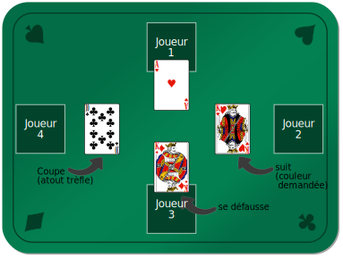

# Règles de la Coinche

La coinche (ou belote coinchée) est un jeu à 4 joueurs, en équipe.

Les joueurs de la même équipe jouent en face l'un de l'autre.

## Cartes

Il y a quatre couleurs :

Pour chaque couleur, il y a 8 cartes, du 7 à l'As, dont la force et les points
sont, dans l'ordre :

À chaque manche, une couleur va être décidée comme étant l'« **Atout** ».
L'ordre et la valeur des cartes change alors, le **valet** et le **neuf**
passent devant :

La somme des cartes valent 152 points, auxquels s'ajoutent 10 points pour le
dernier pli (« dix de der »), soient **un total de 162 points**.

## Étape 1: les enchères

* Chaque joueur (en commençant par le 1er joueur) va miser pour son équipe le
  nombre de points qu'il pense faire, en choisissant une couleur d'atout.

* Les enchères commencent à 82 points, soit la moitié du jeu, et montent de 10
  points en 10 points (ou plus).

* Dès que 4 joueurs d'affilée passent, les enchères prennent fin.
  * si aucune enchère n'a été faite, une nouvelle main est distribuée
  * sinon, la dernière enchère est prise en compte, et le jeu commence, à
  l'atout sélectionné.

Par exemple, un joueur qui fait une enchère à 100 Trèfle, fait le pari que son
équipe va réaliser 100 points si l'atout est trèfle.

Comme le total des points vaut 162 points, on peut enchérir jusqu'à 160 (sauf
exceptions, voir "belote" et "capot").

## Étape 2: le jeu de carte

Comme les 4 joueurs ont 8 cartes en mains, il y a 8 plis de 4 cartes.

### Les plis

Le 1er joueur va poser une carte; les autres joueurs, dans l'ordre, doivent
également poser une carte en suivant les règles suivantes :

* si le joueur possède dans sa main la couleur demandée (♥, ♦, ♣ ou ♠), il doit
  en jouer;
* sinon, s'il a de l'atout, il doit jouer une carte à la couleur de l'atout (ce
  qui s'appelle *couper*);
* sinon, il peut jouer n'importe quelle autre couleur (ce qui s'appelle se
  *défausser*).

Le fait de **couper** (jouer un atout sur une autre couleur) remporte le pli;
sinon c'est la carte la plus forte de la couleur du pli qui remporte.

Le joueur qui pose la carte la plus forte remporte le pli, puis c'est à lui de
commencer, et ainsi de suite jusqu'au huitième et dernier pli.

